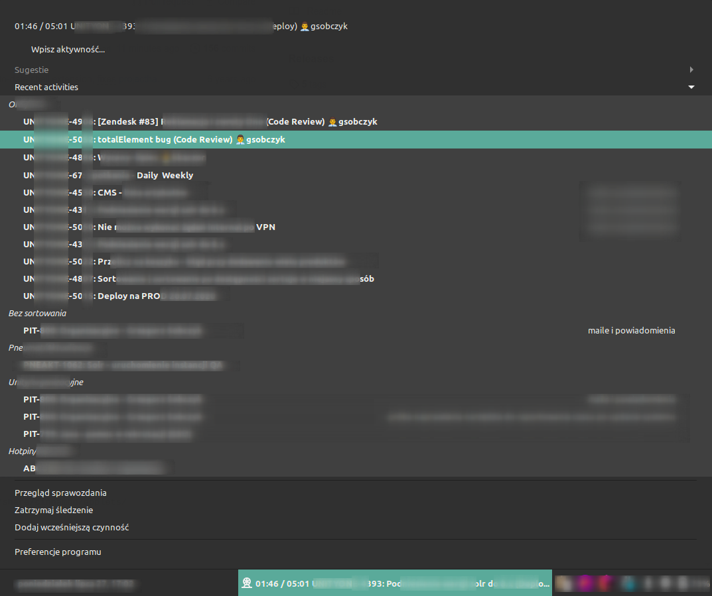
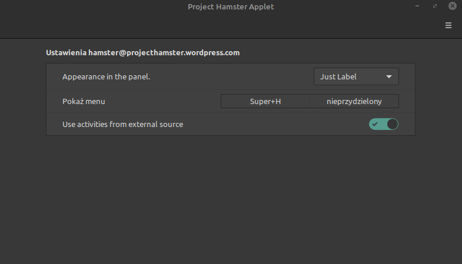

# Cinnamon Applet for hamster
## Prerequisites

Install hamster from [gsobczyk's hamster repository](https://github.com/gsobczyk/hamster)

## Installing

To install the applet just symlink checkout directory into `~/.local/share/cinnamon/applets/`
as hamster@projecthamster.wordpress.com.
It looks something like this:

```shell script
cd ~/.local/share/cinnamon/applets/
ln -s /path/to/the/checkout hamster@projecthamster.wordpress.com
```

**Preferred**: You can also clone git project exactly to applets folder

```shell script
git clone https://github.com/gsobczyk/hamster-cinnamon-applet.git ~/.local/share/cinnamon/applets/hamster@projecthamster.wordpress.com
```

## Screenshots

* applet



* applet settings


